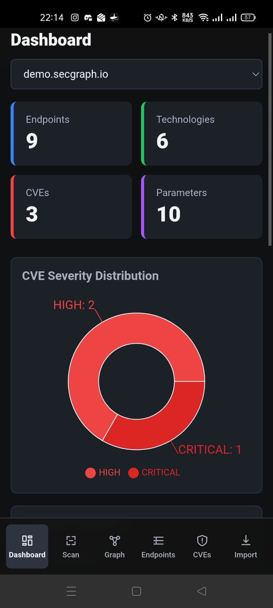
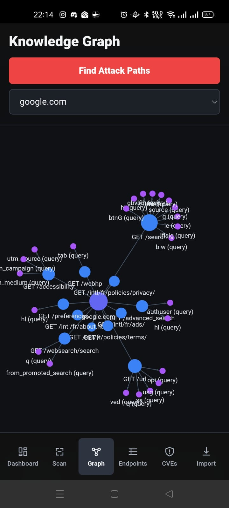
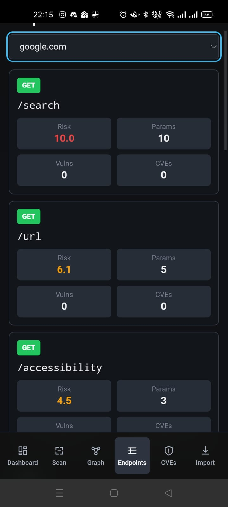

# SecGraph

SecGraph is a web and Android security analysis application. It collects target data, stores it in a Neo4j graph, and shows the result in a simple dashboard and graph interface.

The goal of the project is to help a user explore a web target from different views. The app shows endpoints, technologies, CVEs, parameters, and attack paths in one place.

## What The App Does

- Starts a scan for a target URL
- Collects discovered endpoints and technologies
- Stores the result in a graph database
- Shows a dashboard with key numbers
- Displays a knowledge graph for relationships between targets, endpoints, technologies, parameters, and CVEs
- Calculates endpoint scores and attack paths
- Imports data from Burp Suite, Nmap, and OWASP ZAP
- Runs as a web app and as an Android app

## Main Screens

### Dashboard

The dashboard gives a fast summary of one target. It shows the number of endpoints, technologies, CVEs, and parameters. It also shows the CVE severity chart and the top risk endpoints.



### Knowledge Graph

The graph page helps the user understand how the discovered data is connected. It can also highlight attack paths for the selected target.



### Endpoint Explorer

The endpoint page lists the discovered endpoints with risk score, parameters, vulnerabilities, and related CVEs.



## Technologies Used

- Frontend: React, TypeScript, Vite
- Mobile app: Capacitor Android
- Backend: Spring Boot, Java 17
- Database: Neo4j
- Recon service: Python Flask
- Charts and graph UI: Recharts, react-force-graph-2d
- Container setup: Docker Compose

## Project Structure

```text
secgraph/
├── backend/          Spring Boot API and graph logic
├── frontend/         React web app and Android wrapper
├── recon-service/    Python service for scan and fingerprint tasks
├── docs/             Screenshots and project documentation
└── docker-compose.yml
```

## How To Run The Project

### Option 1: Run With Docker

From the project root:

```bash
docker compose up -d --build
```

After startup:

- Web app: `http://localhost:3000`
- Backend API: `http://localhost:8080/api`
- Neo4j Browser: `http://localhost:7474`

Neo4j login:

- username: `neo4j`
- password: `secgraph123`

## How To Use The App

1. Open the dashboard to view the current target summary.
2. Open the `Scan` page to start a new scan.
3. Enter a target URL, choose the depth, and choose the scan type.
4. Open the `Graph` page to view the knowledge graph.
5. Use `Find Attack Paths` to highlight risky paths in the graph.
6. Open the `Endpoints` page to inspect endpoint scores.
7. Open the `CVEs` page to search known vulnerabilities.
8. Open the `Import` page to upload Burp, Nmap, or ZAP files.

## How To Test The Project

### Web UI Test

1. Start the Docker stack.
2. Open `http://localhost:3000`.
3. Check that the dashboard loads.
4. Start a scan from the `Scan` page.
5. Open the `Graph`, `Endpoints`, and `CVEs` pages.
6. Import a sample file on the `Import` page if needed.

### API Test

Example requests:

```bash
curl http://localhost:8080/api/targets
curl http://localhost:8080/api/scans
curl http://localhost:8080/api/graph/41
curl http://localhost:8080/api/analysis/attack-paths/41
```

### Android Test

For the Android emulator, the app can use `10.0.2.2` to reach the backend on the host machine.

For a real phone, the phone and the computer must be on the same network. In this case, the mobile app must use the IP address of the computer running the backend.

Use an example local IP like this:

```bash
VITE_API_URL=http://192.168.1.100:8080/api npm run android:open:phone
```

Important:

- Do not keep a real personal IP address inside the repository
- Replace `192.168.1.100` with the real IP of your computer only on your own machine
- Keep Docker running while you test the app on the phone

## Notes

- The Docker setup uses the `demo` profile for the backend, so the project starts with demo data.
- The app can still create new scan jobs through the scan page.
- The Android APK can be installed directly for local testing, as long as the backend machine is reachable from the phone.

## Documentation

More detailed project notes are available in [docs/PROJECT_DOCUMENTATION.md](docs/PROJECT_DOCUMENTATION.md).
